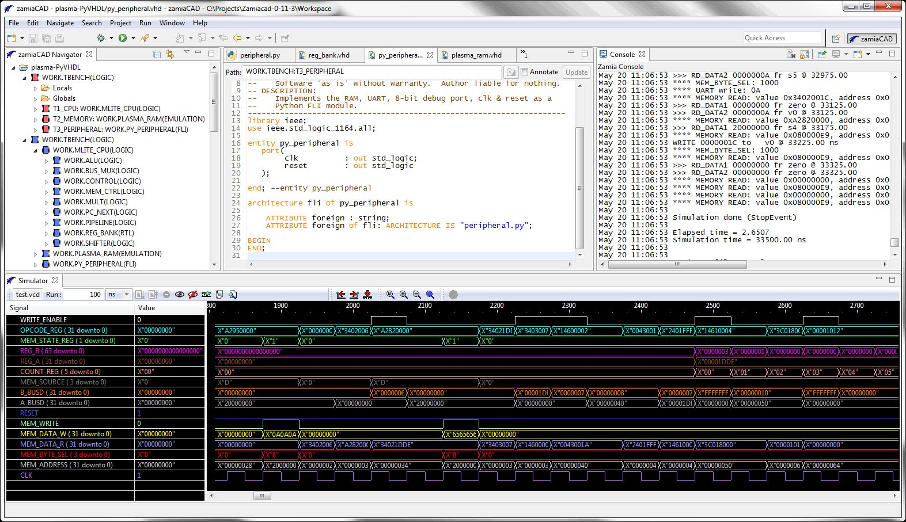

.. PyVHDL documentation master file, created by
   sphinx-quickstart on Tue May 17 14:02:04 2016.
   You can adapt this file completely to your liking, but it should at least
   contain the root `toctree` directive.

PyVHDL: A Hardware Simulation environment integrating Python and VHDL
=====================================================================

Introduction:
-------------

PyVHDL is an open source project for simulating VHDL hardware designs. It cleanly integrates the general purpose `Python <https://www.python.org/>`_ programming language with the specialized `VHDL <https://en.wikipedia.org/wiki/VHDL>`_  hardware description language. You can write the testbench for your VHDL design in Python. You can use all the great features of Python to quickly create your testbench. Some advantages of using Python include:

	* It's an easy to learn, modern mainstream language.
	* Object oriented for better organization of code.
	* Simple and powerful formatting of of text output.
	* Easy file read and write of formatted data.
	* Quality modules available for just about any programming task.

Python can be used for more than just testbenches. You can also create architectures in your VHDL design that are written in Python. Standard VHDL syntax is used to link the architecture to a Python file. Concurrent Python processes can wait for signal transitions, wait for a specified period of time, read values of signals in the design, or update the values of signals with an optional delay. This capability is useful for quickly prototyping the behavior of an entity, or emulating complex behavior like a memory device or UART. 

PyVHDL features a unified execution environment. VHDL is translated to Python bytecode, and runs on the same interpreter as the Python code. There is no overhead wasted on passing data and maintaining synchronization between separate Python and VHDL environments. An advantage of using Python is that PyVHDL can utilize the work of other projects in the very active Python community. For example, using the `Cython optimising compiler <http://cython.org/>`_, the speed of the simulator event queue can be improved by more than a factor of seven.

An important goal of PyVHDL is to create a VHDL simulator that the open source community can easily make contributions to. The simulator is written in Python, a language familiar to many programmers. Python is much easier to read and modify compared to most languages. Also, the hurdle of setting up an obscure tool chain environment is not an issue. The PyVHDL project is maintained on `GitHub <https://github.com/GeezerGeek/PyVHDL>`_.  

The excellent `zamiaCAD <http://zamiacad.sourceforge.net/web/>`_ Eclipse based IDE is packaged with PyVHDL. The zamiaCAD IDE is an open source Eclipse based platform for advanced VHDL hardware design. PyVHDL is tightly integrated with the zamiaCAD IDE. Features provided by zamiaCAD include:

	* An environment for creating and managing PyVHDL projects.
	* VHDL editing with syntax highlighting and checking.
	* Graphical tools for visualizing and navigating the VHDL hierarchy.
	* Configuration and running of simulations.
	* A waveform viewer for displaying the results of a simulation.
	* A VHDL parser used by PyVHDL for analysis and elaboration.    

	The zamiaCAD+PyVHDL IDE

.. caution::
	PyVHDL 0.0.1 is an alpha release! Not all VHDL syntax is supported. Un-supported VHDL syntax includes:

	* Functions and Procedures.
	* Type statements.
	* Arrays and structures.
	* Libraries written in VHDL (std_logic and std_logic_vectors are supported natively in Python).

	Despite these limitations, PyVHDL can simulate the 32-bit, MIPs compatible, plasma CPU design, and pass plasma's instruction set test suite!

Documentation Contents:
=======================

.. toctree::
	:maxdepth: 2

	Quickstart <quickstart>

	Write a Python testbench <testbench>

	License <license>

Indices and tables
==================

* :ref:`genindex`
* :ref:`modindex`
* :ref:`search`
