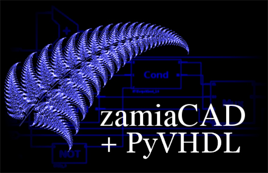
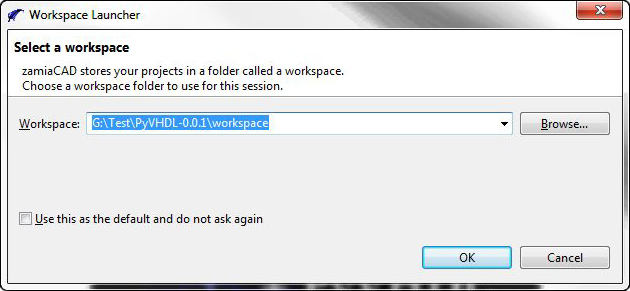
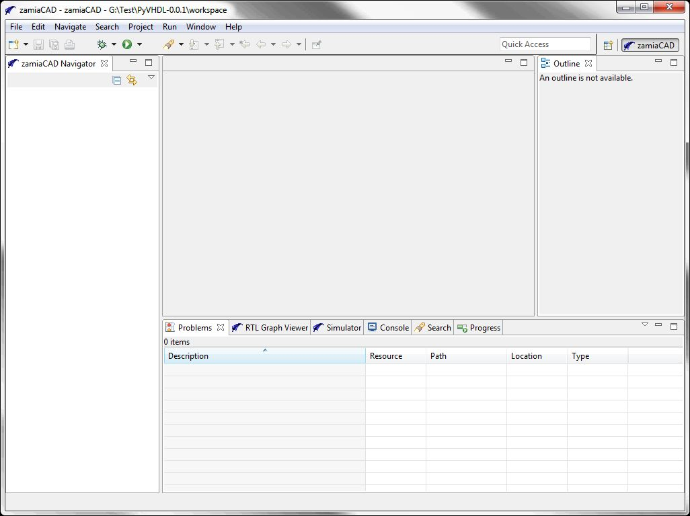

Quickstart
==========

.. contents:: Quickstart table of contents:
	:depth: 3

Requirements
------------

	.. Note::
		At this time, zamiaCAD+PyVHDL has been tested on Windows 7 only.

	* Java Runtime Environment version 1.8. Install the 64 bit version of the JRE.

	* `Stackless Python 2.7 <https://bitbucket.org/stackless-dev/stackless/wiki/Download>`_ choose the amd64 version.

Install PyVHDL
--------------

	Download PyVHDL-0.0.1.zip from GitHub `here <https://github.com/GeezerGeek/PyVHDL/releases/tag/v0.0.1-alpha>`_.
	Extract the contents of the zip file to a location of your choice. I use C:/Projects/PyVHDL

zamiaCAD
--------

	As noted above, PyVHDL runs alongside the zamiaCAD Eclipse IDE. zamiaCAD provides an environment for creating VHDL design projects, editing VHDL files, Analyzing and elaborating a VHDL design, controlling	a simulation, and displaying waveform files generated by a simulation. If you have used the Eclipse framework before, you will feel fairly at home using zamiaCAD. zamiaCAD has many features that facilitate working with VHDL designs. Read this `zamiaCAD tutorial <http://zamiacad.sourceforge.net/web/sites/default/files/zamiaCAD_0.10_tutorial.pdf>`_ to learn more about zamiaCAD`s features.    
	
	Zamiacad is split into an IDE component, and a VHDL processing component. It is possible to run simulations without the IDE in command line mode using just the VHDL processing component.

Initial zamiaCAD setup
++++++++++++++++++++++

Navigate to the **PyVHDL-0.0.1** directory. Double click on **run_giu.bat**. The zamiaCAD+PyVHDL splash screen should appear:

	zamiaCAD+PyVHDL Splash Screen

Next a **Workspace Launcher** dialog should appear. Accept the default workspace that appears in the Workspace textbox. It should be a folder named ``workspace`` in the PyVHDL installation folder:

	Workspace Launcher Dialog

Click on the **Use this as the default and do not ask again** checkbox, then click on **OK**. The initial zamiaCAD+PyVHDL IDE should appear.

	Initial zamiaCAD+PyVHDL IDE

Run the plasma demo
-------------------

The plasma demo is a zamiaCAD+PyVHDL project for simulating the plasma CPU design. Plasma is a 32-bit MIPs compatible processor. The design is a set of RTL style VHDL files.

Setup a new project
+++++++++++++++++++

Before the plasma project can be simulated, a new project must be setup in the zamiaCAD Navigator view. Make sure the zamiaCAD perspective is active. It should appear highlighted in the upper right corner of the IDE window. On the top menu select **File > New > zamiacad Project**. The **Create New zamiaCAD Project** dialog will appear.

	Create New zamiaCAD Project Dialog

In the Project name textbox enter ``plasma``. Click Finish. A **Do Full Build?** dialog will appear. Click **No**. A project folder labled ``plasma`` will now appear in the IDE **zamiaCAD Navigator** view.

Import the archived project
+++++++++++++++++++++++++++

The zamiaCAD+PyVHDL IDE allows projects to be archived, and later imported back into the IDE workspace. The folder at **PyVHDL-0.0.1/share/saved-projects** contains the plasma project archived as ``plasma-PyVHDL.zip``.

Make sure the plasma project is highlighted in the IDE **zamiaCAD Navigator** view. Right click on the plasma project folder. In the context menu that appears select **Import...**. The Import dialog will appear. Double click on the **General** folder, and select **Archive File**, then click the **Next >** button.

	Import Dialog

Now a dialog appears where the import is setup. Click on the **Browse...** button to the right of the **From archive file:** text box.	Navigate to the **PyVHDL-0.0.1/share/saved-projects**folder, and select the **plasma-PyVHDL.zip** file. Click the **Open** button. Now the completed Import dialog should look like this:

	Completed Import Dialog

Click on the **Finish** button. In the Question dialogs that appears, click the **Yes** button. In the **Do Full Build?** dialog, click **Yes**. zamiaCAD will analyze and elaborate the plasma design. A log of that process will be in the **Zamia Console** window. Click on the plasma project folder. The project navigation information will appear below the folder. The red and blue rectangular icons can be opened to view the project design hierarchy. The files that make up the project are listed below the icons. You are now ready to setup and run a PyVHDL simulation.

	The IDE After Plasma Project is Built

Configure a simulation
++++++++++++++++++++++

Make sure the plasma project is highlighted. On the IDE menu click **Run > Run Configurations...**. The **Run Configurations** dialog appears. Right click on **zamiaCAD Simulation**, and select **New**.

The right side of the dialog now displays the settings for the new configuration.

	- In the **Name:** text box type ``plasma PyVHDL``.
	- Click the **Browse...** button next to the **Project** text box. Select the plasma project folder, and click **OK**.
	- Click on the **Simulator:** dropdown, and select **Python Simulator**.
	- Click on the **Browse...** button next to the **Toplevel:** textbox. **TOPLEVEL WORK.TESTBENCH** should be highlighted. Click **OK**.
	- Click the **Browse...** button next to the **Flle:** textbox. Navigate to the **PyVHDL-0.0.1\\workspace\\plasma** folder. Select the **test.vcd** file. Click the **Open** button.
	- The **Signal path prefix:** textbox should be empty.
	 
Check that the fields in  the **Run Configurations** dialog match the figure below:

	Completed Run Configurations Dialog

Run the simulation
++++++++++++++++++

Click the **Run** button. If a **Do Full Build ?** dialog appears, click **Yes**. Open the **Zamia Console** window if it is not open. The text at the bottom of the console window will look similar to this, without the coloring::

	Jun 03 18:00:47 >>> RD_DATA1 00000000 fr zero @ 33325.00
	Jun 03 18:00:47 **** MEMORY READ: value 0x00000000, address 0x000003A8 @ 33325.00
	Jun 03 18:00:47 **** MEMORY READ: value 0x080000E9, address 0x000003A4 @ 33375.00
	Jun 03 18:00:47 **** MEMORY READ: value 0x00000000, address 0x000003A8 @ 33425.00
	Jun 03 18:00:47 **** MEMORY READ: value 0x080000E9, address 0x000003A4 @ 33475.00
	Jun 03 18:00:47 
	Jun 03 18:00:47 Simulation done (StopEvent)
	Jun 03 18:00:47 
	Jun 03 18:00:47 Elapsed time = 2.8060
	Jun 03 18:00:47 Simulation time = 33500.00 ns
	Jun 03 18:00:47 
	Jun 03 18:00:47 
	Jun 03 18:00:47 Zamia Profiler Results
	Jun 03 18:00:47 ======================
	Jun 03 18:00:47 
	Jun 03 18:00:47     2.71s ZDB commit
	Jun 03 18:00:47     0.00s Synth
	Jun 03 18:00:47     0.03s Indexing
	Jun 03 18:00:47     2.24s Parsing
	Jun 03 18:00:47     3.42s IG

Make sure the **Simulator** window is visible. The IDE will look similar to this:

	IDE After Simulation Run

To select the signal waveforms to be displayed in the **Simulator** window, click on the **Eye** icon on the **Simulator** menu.	The **Select signals to trace** dialog appears. In the **Select signals to be traced** textbox enter `*`. A list of signals will appear. Select all the signals. Click **OK**. The names and waveforms of the signals will now appear:

	IDE Displaying Waveforms

The IDE windows can be resized to show more of the waveforms. You can click on the **Simulator** window magnifying glass menu icons to zoom in, zoom out, or zoom full.

This completes the zamiaCAD+PyVHDL Quickstart tutorial. Read this `zamiaCAD tutorial <http://zamiacad.sourceforge.net/web/sites/default/files/zamiaCAD_0.10_tutorial.pdf>`_ to learn more about the very useful features of the IDE. 
